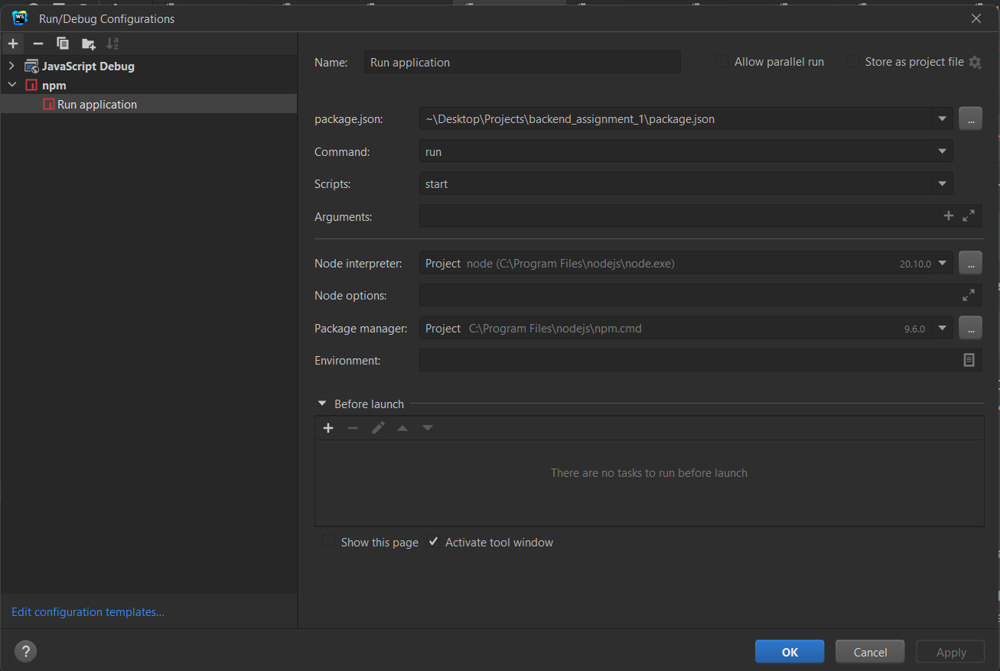

## Steps to implement the project

**1. Clone the application**

```bash
git clone https://github.com/Az1mzhan/web_lab_2.git
```

**2. Install required package using the command below in the directory**

```
npm install
```

**3. Run the application using the command below in the directory**

```
nodemon app.js
```

OR

```
node app.js
```

_Note:_ If you are working in WebStorm IDE, use _Configuration menu_ in the top-right corner → _Edit Configurations..._ → _Add New Configuration_ → npm.

Below I will provide options for the configuration



**4. Running the server**

After you started the application, the server will start on the _localhost:3000_. If you want to change the port, you may edit its value in _app.js_. If you want to change source code and test it on the site, you don't have to reload the application since _nodemon_ package enable to track changes in source code.

**5. Enjoy**